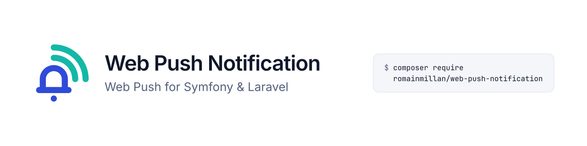

<p align="center">
  <picture>
    <source media="(prefers-color-scheme: dark)" srcset="art/banner-dark.png">
    <source media="(prefers-color-scheme: light)" srcset="art/banner-light.png">
    
  </picture>
</p>

<p align="center"><strong>Web Push notifications for Symfony and Laravel: subscription storage, VAPID delivery, an SSRF-hardened transport and a ready-to-use service worker.</strong></p>

<p align="center">
  <a href="https://github.com/romainmillan/web-push-notification/actions/workflows/ci.yml"></a>
  <a href="https://packagist.org/packages/romainmillan/web-push-notification"></a>
  <a href="LICENSE"></a>
</p>

---

## Why this package

Web Push looks like twenty lines of code: subscribe in the browser, store the JSON, call
`minishlink/web-push`. Two production applications (a Symfony personal-finance PWA and a
Laravel notification hub) showed what those twenty lines leave out:

- **The endpoint is a capability URL.** Whoever holds it can push to the device. It ends up in
  logs, exception messages, failed-job tables and error trackers unless every layer is written
  not to leak it.
- **The endpoint is an outbound URL chosen by the client.** Storing it and calling it from your
  server is a textbook SSRF: `https://fcm.googleapis.com@169.254.169.254/`, DNS rebinding,
  redirects to internal hosts, IPv4-mapped IPv6 addresses.
- **iOS is different.** Push only works for a PWA added to the home screen, the permission
  prompt must follow a user gesture, a frozen page thaws whenever it wants, and a push that
  shows nothing costs you the subscription.
- **Subscriptions die.** Push services answer 404/410, keys rotate (Safari), browsers change
  hands, VAPID keys get rotated. Each case needs a defined outcome, not a silent failure.

This package packs those lessons once, with tests, for both frameworks.

## Features

- **One PHP core, two bridges**: a Symfony bundle and an auto-discovered Laravel service provider.
- **Subscriptions stored for you** (Doctrine DBAL or Eloquent, or your own adapter): list,
  revoke and erase a subscriber's devices.
- **Registration matrix** implemented in the aggregate: renewals, key rotations, shared
  browsers changing hands only on proof of possession, no identified → anonymous downgrade.
- **Per-subscriber quota** (16 by default) evicting the least recently registered device;
  opt-in anonymous subscriptions with a global cap and a mandatory rate limiter.
- **SSRF-hardened delivery**: push-service allowlist, canonical endpoints only, public-IP policy,
  DNS pinning with `CURLOPT_RESOLVE`, no redirects, https only.
- **Classified outcomes** (`Delivered`, `Expired`, `Transient`, `Permanent`, `Skipped`) and a
  mandatory expiry step; `delete` or `deactivate` retirement policy.
- **Sync or async**: immediate, Symfony Messenger or Laravel Queue, all through a single delivery path.
- **Symfony Notifier channel** (`web_push`) and **Laravel Notifications channel** (`web-push`),
  with configurable default TTL and urgency, overridable per notification.
- **Signed action URLs**: an `ActionUrlSigner` per framework (Symfony `UriSigner`, Laravel
  temporary signed routes) for lock-screen buttons that POST back to your app.
- **Optional encryption at rest** (XChaCha20-Poly1305, key rotation).
- **Frontend package** `@romainmillan/web-push-notification`: page client, Stimulus controller,
  prebuilt service worker served by a PHP route (no build step), usable standalone or through
  `importScripts()` from your own worker, plugins for iOS navigation intents, client state,
  diagnostics and app badge.
- **A versioned payload contract** (v1) shared by PHP and the service worker, tested on both sides.
- **CLI**: generate VAPID keys, send a test notification, purge old subscriptions.
- **A shipped repository contract** (`Testing\SubscriptionRepositoryContract`) to test your own
  storage adapter against the same suite as the bundled ones (SQLite, MySQL 8.4, PostgreSQL 17).

## Requirements

| | |
|---|---|
| PHP | ≥ 8.2 with `ext-curl`, `ext-sodium`, `ext-json` (and `ext-openssl`, `ext-mbstring`, required by `minishlink/web-push`) |
| Recommended | `ext-gmp` or `ext-bcmath` (faster VAPID signing and payload encryption) |
| Symfony | 6.4, 7.x or 8.x, with `symfony/security-bundle`, `symfony/rate-limiter` and CSRF protection enabled |
| Laravel | 11 or 12 |
| Browsers | Any browser with the Push API; iOS/iPadOS 16.4+ for PWAs added to the home screen |

## Quick start: Symfony

```bash
composer require romainmillan/web-push-notification
```

Register the bundle (no Flex recipe yet):

```php
// config/bundles.php
return [
    // ...
    RomainMillan\WebPushNotification\Bridge\Symfony\WebPushNotificationBundle::class => ['all' => true],
];
```

Generate a key pair and store it as secrets or environment variables (never commit them):

```bash
php bin/console webpush:vapid:generate
```

```yaml
# config/packages/web_push_notification.yaml
web_push_notification:
    vapid:
        public_key: '%env(VAPID_PUBLIC_KEY)%'
        private_key: '%env(VAPID_PRIVATE_KEY)%'
        subject: 'mailto:ops@example.com'
```

The application origin (used by signed action URLs) is derived from
`framework.router.default_uri`, or set explicitly with `origin: 'https://app.example.com'`.

```yaml
# config/routes/web_push_notification.yaml
web_push_notification:
    resource: '@WebPushNotificationBundle/config/routes.php'
```

Create the table (`php bin/console doctrine:migrations:diff`), then give your user a stable identifier:

```php
use RomainMillan\WebPushNotification\Bridge\Symfony\Security\WebPushSubscriber;

final class User implements UserInterface, WebPushSubscriber
{
    public function getWebPushSubscriberId(): string
    {
        return 'user:'.$this->id; // stable and never reused: never the e-mail
    }
}
```

Render the client configuration in your layout, then start the frontend (see [Frontend](#quick-start-frontend)):

```twig
<head>
    {{ web_push_meta() }}
</head>
```

Send a notification:

```php
use RomainMillan\WebPushNotification\Application\Port\PushDispatcher;
use RomainMillan\WebPushNotification\Domain\Delivery\SubscriberAudience;
use RomainMillan\WebPushNotification\Domain\Message\ClickPath;
use RomainMillan\WebPushNotification\Domain\Message\DeliveryOptions;
use RomainMillan\WebPushNotification\Domain\Message\WebPushMessage;

$pushDispatcher->dispatch(
    SubscriberAudience::fromSubscriberId('user:42'),
    WebPushMessage::createWithTitle('Payment received', '120 € from ACME')
        ->withClickPath(ClickPath::fromString('/app/payments/42')),
    $deliveryOptions, // the autowirable DeliveryOptions service: delivery.ttl / delivery.urgency
);
```

Full reference: [docs/symfony.md](docs/symfony.md).

## Quick start: Laravel

```bash
composer require romainmillan/web-push-notification
php artisan web-push:vapid
```

The service provider is auto-discovered and validates its configuration at boot. With
`VAPID_SUBJECT` set, `APP_URL` is not read at boot; it becomes the application origin on first
use and must then be `https://…` (or `http://localhost` in development). Put the keys in `.env`:

```dotenv
VAPID_PUBLIC_KEY=...
VAPID_PRIVATE_KEY=...
VAPID_SUBJECT=mailto:ops@example.com
```

Publish and run the migration:

```bash
php artisan vendor:publish --tag=web-push-migrations
php artisan migrate
```

Add the meta tag to your layout (`@webPushMeta` or `<x-web-push::meta/>`):

```blade
<head>
    @webPushMeta
</head>
```

Send through Laravel Notifications:

```php
use Illuminate\Notifications\Notification;
use RomainMillan\WebPushNotification\Bridge\Laravel\Notifications\WebPushChannel;
use RomainMillan\WebPushNotification\Bridge\Laravel\Notifications\WebPushNotification;
use RomainMillan\WebPushNotification\Domain\Message\WebPushMessage;

final class PaymentReceived extends Notification implements WebPushNotification
{
    public function via(object $notifiable): array
    {
        return [WebPushChannel::class];
    }

    public function toWebPush(object $notifiable): WebPushMessage
    {
        return WebPushMessage::createWithTitle('Payment received', '120 € from ACME');
    }
}

$user->notify(new PaymentReceived());
```

Full reference: [docs/laravel.md](docs/laravel.md).

## Quick start: frontend

The page client, the Stimulus controller and the service worker ship as
`@romainmillan/web-push-notification` (also available in `vendor/romainmillan/web-push-notification/assets`).
The service worker itself needs **no build**: the PHP route `/web-push-sw.js` serves the prebuilt
script with your configuration injected.

```js
import { startWebPush } from '@romainmillan/web-push-notification';

const webPush = startWebPush(); // registers /web-push-sw.js, claims iOS navigation intents, hooks logout

document.querySelector('#enable-notifications')?.addEventListener('click', () => {
    webPush?.client.subscribe(); // must run inside a user gesture (iOS)
});
```

Already have a service worker? Make it call `importScripts('/web-push-sw.js')` and point
`service_worker.register_url` at it (or pass `startWebPush(document, { serviceWorkerUrl: '/sw.js' })`).

Or use the Stimulus controller shipped for Symfony UX. Per-build-tool setup (Encore, Vite,
AssetMapper, Laravel/Vite): [docs/frontend.md](docs/frontend.md).

## Security highlights

- The endpoint never appears in logs, exceptions, outcomes or queue messages: only a 12-character fingerprint and the push service host.
- Endpoints must belong to an allowed push service, be canonical, resolve to public IPs only; connections are pinned to the checked address, redirects are refused.
- A browser only changes hands on proof of possession of its `auth` secret; an identified subscription is never downgraded to anonymous.
- The shipped routes deny anonymous visitors by default (before reading the body), require CSRF, bound the body to 4 KiB and answer a uniform 204 (no oracle); unsubscribe is always rate limited.
- `ActionUrl` targets must carry their own authorization: the shipped `ActionUrlSigner` produces short-lived signed URLs within your origin. The body is visible on the lock screen.
- Optional encryption at rest with authenticated associated data and key rotation.

Read [docs/security.md](docs/security.md) before going to production.

## Documentation

| Document | Content |
|---|---|
| [docs/symfony.md](docs/symfony.md) | Symfony installation and configuration reference |
| [docs/laravel.md](docs/laravel.md) | Laravel installation and configuration reference |
| [docs/frontend.md](docs/frontend.md) | JS client (shipped in `assets/dist`), build tools, Stimulus controller, service worker, iOS |
| [docs/payload-contract.md](docs/payload-contract.md) | The v1 payload contract between PHP and the service worker |
| [docs/security.md](docs/security.md) | Threat model and security decisions |
| [docs/consistency.md](docs/consistency.md) | Eventual consistency cases and concurrency |
| [docs/context-map.md](docs/context-map.md) | Architecture, ubiquitous language, lifecycle, events |
| [docs/migration-guide.md](docs/migration-guide.md) | Migrating hand-written Web Push code (Finance, Notifier) |
| [docs/contributing.md](docs/contributing.md) | Development environment, tests, CI, releasing |
| [CHANGELOG.md](CHANGELOG.md) | Release notes |

## License

MIT, see [LICENSE](LICENSE).
