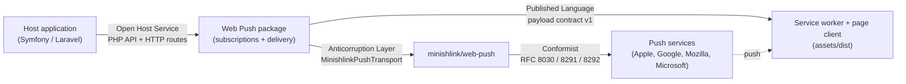
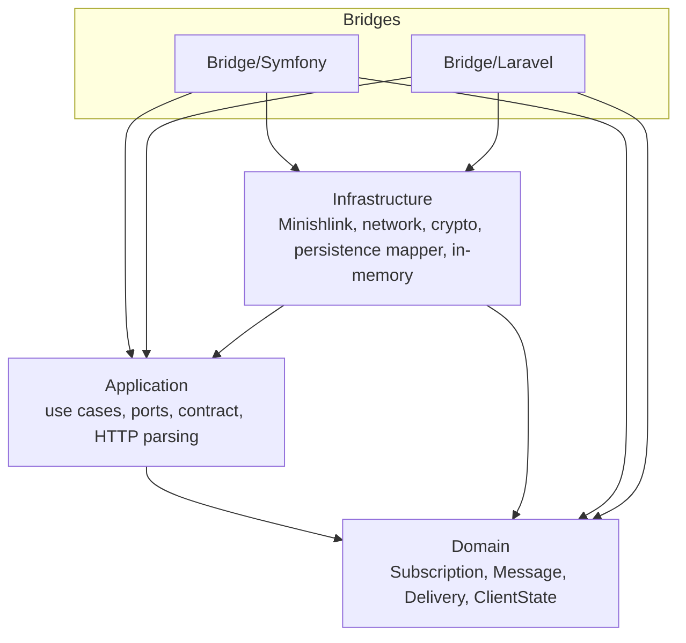
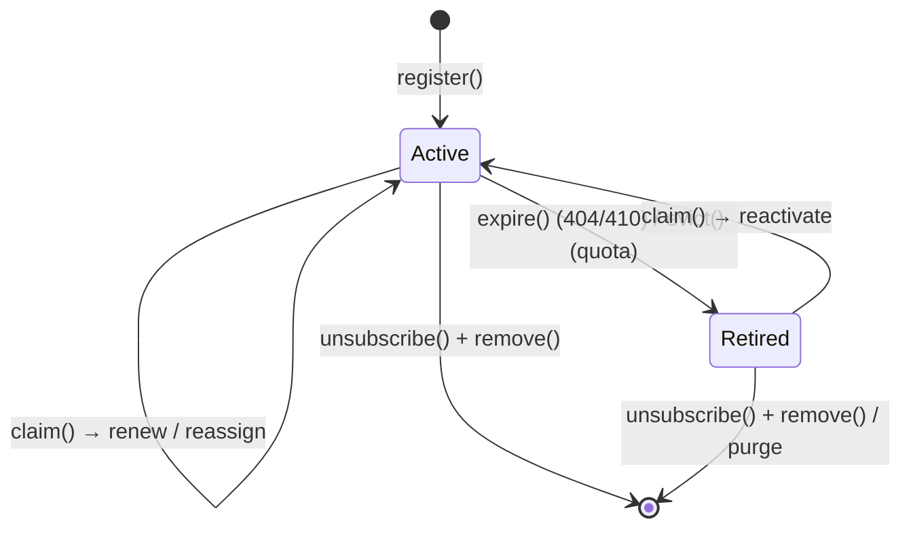
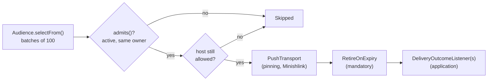

# Context map and architecture

- [Context map](#context-map)
- [Ubiquitous language](#ubiquitous-language)
- [Layers](#layers)
- [The `Subscription` aggregate](#the-subscription-aggregate)
- [Registration matrix](#registration-matrix)
- [Delivery path](#delivery-path)
- [Event catalogue](#event-catalogue)
- [Ports](#ports)
- [Non-goals](#non-goals)

## Context map

| Relationship | Upstream → downstream | Pattern | Where |
|---|---|---|---|
| Host application → package | Package is upstream | **Open Host Service**: a small, documented PHP API (`PushDispatcher`, `WebPushSender`, `ListSubscriptions`, `RevokeSubscription`, `RemoveAllSubscriptions`), the HTTP routes, Twig/Blade helpers, single-method integration interfaces (`WebPushSubscriber`, `WebPushRecipientInterface`, `WebPushNotificationInterface`, `WebPushNotification`) | `src/Application`, `src/Bridge/*` |
| Package → service worker | Package is upstream | **Published Language**: contract v1, a JSON Schema and shared fixtures tested by PHPUnit and Vitest | `src/Application/Contract`, `tests/Fixtures/payload` |
| Package → Minishlink | Package protects itself | **Anticorruption Layer**: Minishlink's vocabulary (`publicKey`/`authToken`, `MessageSentReport`, reason strings embedding the URL) never leaks into the model; reports become classified `DeliveryOutcome`s | `src/Infrastructure/Minishlink` |
| Package → push services | Push services are upstream | **Conformist**: the package follows the Web Push protocol and each service's status codes as they are (`HttpStatusClassifier`) | `src/Infrastructure/Minishlink/HttpStatusClassifier.php` |

## Ubiquitous language

| Term | Meaning | Remark |
|---|---|---|
| **Subscription** | One browser's push subscription (one device) | The single term in code, configuration and events (`max_subscriptions_per_subscriber`) |
| **Subscriber** | Stable, immutable application identity receiving notifications (`SubscriberId`, e.g. `user:42`) | Never an e-mail nor a mutable identifier |
| **Owner** | Who a subscription belongs to: `IdentifiedOwner(SubscriberId)` or `AnonymousOwner` | A sum type: no `null` in the domain |
| **Audience** | Who a notification goes to: a subscriber, precise subscriptions, or everyone | Strategy: `SubscriberAudience`, `SubscriptionsAudience`, `Everyone` |
| **Push address** | Endpoint + keys (`p256dh`, `auth`) + content encoding | `PushAddress` |
| **Fingerprint** | SHA-256 of the canonical endpoint; its 12-character prefix is the loggable form | `EndpointFingerprint` |
| **Proof of possession** | Presenting the subscription's `auth` secret | Compared in constant time |
| **Claim** | A browser presenting an endpoint the package already knows | `Subscription::claim()`, the registration matrix |
| **Least recently registered** | Eviction criterion: the smallest `lastRegisteredAt` | Used instead of "LRU": registration is the only signal a device sends |
| **Retire** | A subscription leaves service (expired or evicted) | What happens to its row is the `RetirementPolicy` (`delete` / `deactivate`) |
| **Unsubscribe** | A subscription is deleted on purpose (owner, possession, revoked, account removed) | Not a retirement |
| **Delivery outcome** | The classified result of one attempt: `Delivered`, `Expired`, `Transient`, `Permanent`, `Skipped` | Codes and categories only, never raw text |
| **Client state marker** | HMAC tag telling which account the worker's local state belongs to | Module `ClientState`, distinct from Owner |
| **Navigation intent** | `{clickPath, at, marker}` left by the worker for a page to claim | iOS frozen pages |

## Layers

Enforced by deptrac (`deptrac.yaml`, run in CI):

| Layer | May depend on |
|---|---|
| Domain | itself and `symfony/string` only |
| Application | Domain, `symfony/string`, PSR interfaces |
| Infrastructure | Domain, Application, `symfony/string`, PSR, Minishlink, Guzzle |
| Bridge/Symfony | the above + Symfony, Doctrine, Twig |
| Bridge/Laravel | the above + Illuminate (and Symfony components used by Laravel) |

Transverse rules: every class is `final` except where a framework imposes inheritance (bundle,
service provider, commands, Eloquent model, DBAL middlewares, Twig extension, the Doctrine
schema entity) and the abstract `SubscriptionEvent` base of the events; strings go through
`symfony/string`; parameters receiving secrets are `#[\SensitiveParameter]`; the time (`$at`)
is always passed in, `psr/clock` is only read in the Application layer.

## The `Subscription` aggregate

Four attributes: `SubscriptionId`, `Owner`, `PushAddress`, `Lifecycle` (registration dates +
`Active | Retired(reason, at)`), plus recorded events. No getters: persistence goes through a
`snapshot()` memento, delivery through `deliveryTarget()`.

| Method | Transition | Event |
|---|---|---|
| `Subscription::register(id, owner, address, at)` | ∅ → Active | `SubscriptionRegistered` |
| `claim(Owner, PushAddress, at): ClaimOutcome` | The whole matrix below; delegates to private `renew`, `reassignTo`, `reactivate` | Depending on the outcome |
| `expire(at)` | Active → Retired(expired) | `SubscriptionExpired` |
| `evict(at)` | Active → Retired(evicted) | `SubscriptionEvicted` |
| `unsubscribe(UnsubscribeCause, at)` | Records the fact; the caller then removes the row | `SubscriptionUnsubscribed(cause)` |
| `isActive()`, `isOwnedBy()`, `isRegisteredBefore()`, `isRetiredSince()`, `isProvenBy()`, `isServedBy()` | Queries | – |
| `releaseEvents()` | Hands the recorded events over | – |

`ClaimOutcome`: `Registered`, `Renewed`, `Reassigned`, `Reactivated`, `RefusedHostNotAllowed`,
`RefusedAuthMismatch`, `RefusedDowngrade`, `RefusedAnonymousCap`. Refusals leave the aggregate
untouched and are never exposed over HTTP. `Registered`, `Reassigned` and `Reactivated` apply the
quota (`Owner::subscriptionLimit()`: `PerOwnerLimit` evicting via `DeviceQuota`, or
`GlobalAnonymousCap` refusing).

## Registration matrix

Orchestrated by `RegisterSubscription`: allowlist first → endpoint lock → read the current owner →
owner locks (sorted) → one transaction: claim or register, quota, save → events after commit.

| Fingerprint known? | State | Owner | `auth` | Result |
|---|---|---|---|---|
| – | – | – | – | host not allowed → neutral refusal |
| no | – | – | – | `register`, then quota |
| yes | Active | same | any (identified) / same (anonymous) | `renew` |
| yes | Active | different, incl. anonymous → identified | same | `reassignTo`, then quota of the new owner |
| yes | Active | different | different | neutral refusal |
| yes | Active | identified → anonymous | – | neutral refusal (no downgrade) |
| yes | Retired | same | any (identified) / same (anonymous) | `reactivate`, then quota |
| yes | Retired | different | same | `reactivate` for the new owner, then quota |
| yes | Retired | different | different | neutral refusal |
| yes | Retired | identified → anonymous | – | neutral refusal |

## Delivery path

`DeliverPayload::deliver(Audience, EncodedPayload, DeliveryOptions): DeliveryReport` is the only
delivery path: `WebPushSender` (sync), `ImmediatePushDispatcher`, the Messenger handler and the
Laravel job all call it, so the checks exist once.

## Event catalogue

Namespace `RomainMillan\WebPushNotification\Domain\Subscription\Event`. Every subscription event
extends `SubscriptionEvent` and carries `subscriptionId`, `fingerprint`, `owner` and
`occurredAt`, **never the endpoint**. Published after the real commit.

| Event | When | Extra fields |
|---|---|---|
| `SubscriptionRegistered` | A browser subscribed for the first time | – |
| `SubscriptionRenewed` | A known device registered again (daily sync, key rotation) | – |
| `SubscriptionReassigned` | A browser changed hands after proof of possession (audit it) | `previousOwner` |
| `SubscriptionReactivated` | A retired device came back (followed by `SubscriptionReassigned` if the owner changed) | – |
| `SubscriptionExpired` | The push service answered 404/410 | – |
| `SubscriptionEvicted` | The owner's quota made room for a newer device | – |
| `SubscriptionUnsubscribed` | Deleted on purpose | `cause`: `owner`, `possession`, `revoked`, `account_removed` |
| `SubscriptionsPurged` | A bulk purge ran (not a `SubscriptionEvent`) | `retired`, `abandonedAnonymous`, `occurredAt` |

## Ports

| Port | Role | Implementations |
|---|---|---|
| `Domain\Subscription\SubscriptionRepository` | Write side, collection-like | Doctrine DBAL, Eloquent, in-memory |
| `Domain\Subscription\PurgeableSubscriptions` | Bulk deletions | same |
| `Application\Port\SubscriptionReadModel` | `listFor(Owner): list<SubscriptionView>` (light CQRS) | same |
| `Application\Port\TransactionBoundary` | `run()`, `afterCommit()`, `reset()` | Doctrine, `DB`, in-memory |
| `Application\Port\SubscriptionLock` | Ordered locks | Symfony Lock, `Cache::lock`, local |
| `Application\Port\CurrentOwner` | Who is registering (decorated by `AnonymousGate`) | Security token storage, Laravel Auth |
| `Application\Port\PushTransport` | Web Push protocol | `MinishlinkPushTransport` |
| `Application\Port\PushDispatcher` | Fire-and-forget entry point | Immediate, Messenger, Queue |
| `Application\Port\SubscriptionCipher` | Encryption at rest | AEAD, null |
| `Application\Port\ClientStateMarkerFactory` | Marker derivation | HMAC |
| `Application\Port\SubscriptionIdGenerator` | Identity before persistence | random 128 bits |
| `Application\Port\DeliveryOutcomeListener` | Application extension point | yours |
| `Application\Port\ActionUrlSigner` | Signed, short-lived `PostAction` URLs within the `Origin` | `SymfonyActionUrlSigner` (`UriSigner`), `LaravelActionUrlSigner` (`temporarySignedRoute`) |

The storage ports come with their executable contract, `Testing\SubscriptionRepositoryContract`
(shipped in `src/Testing`): every adapter, the package's and yours, extends the same suite.

## Non-goals

- **Event Sourcing**: events are notifications of facts, not the source of truth; the table is.
- **Offline caching / `fetch` handling** in the service worker: combine the package with your own
  worker if you need it ([frontend.md](frontend.md#using-your-own-service-worker)).
- **Several VAPID key pairs** (per tenant, or overlapping during a rotation): one pair per application.
- Storing user agents or device labels (GDPR minimisation).
